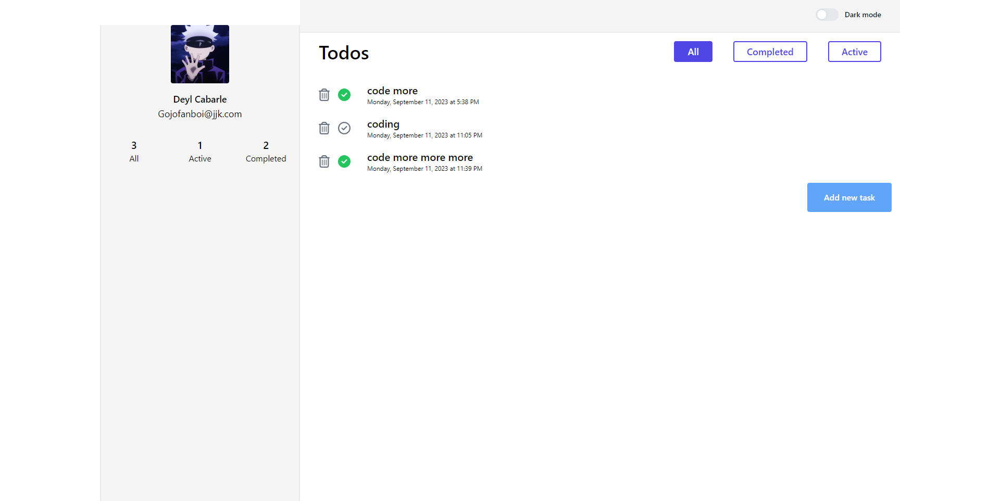

# Todo App:

#### imagine and create the ui as a whole

#### break the ui as individual components

#### hierarchy of components:

app components :
  1. Sidebar 
1.1 Profile Component 
1.2 Status Component  2. Main Content 
2.1 Header 
2.2 Todos 
2.2.1 Todos Header 
2.2.2 Todos Body 
2.2.2.1 Todo 

#### create a static version of the app

#### add the dynamic data using hooks

## what it can do?

1. add todo
2. delete todo
3. handleClick for complete todo
4. it can filter todos
5. it can show how many todos, completed todos and active todos on the sidebar

## what did i learn?

1. how to config axios(first time using btw)
2. i learn how to perform crud using axios
3. how to use a loading state to a component when fetching
4. how to filter data using onclick state and filter fn.
5. dark mode TBA haha
