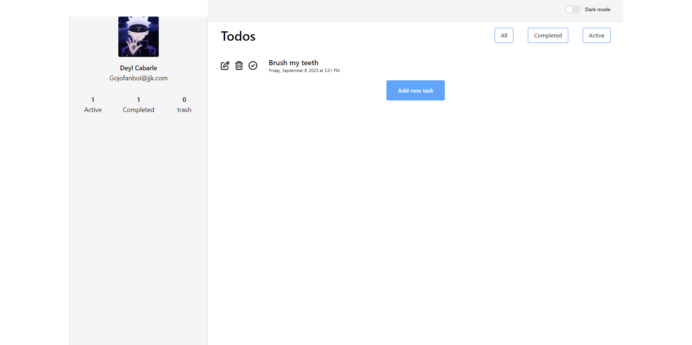

# Todo App: 

#### imagine and create the ui as a whole
#### break the ui as individual components 
#### hierarchy of components: 
app components : 
    1. Sidebar
        1.1 Profile Component
        1.2 Status Component
    2. Main Content
        2.1 Header
        2.2 Todos
            2.2.1 Todos Header
            2.2.2 Todos Body
                2.2.2.1 Todo

#### create a static version of the app

#### add the dynamic data using hooks 
